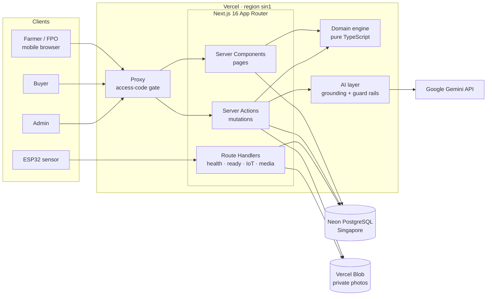
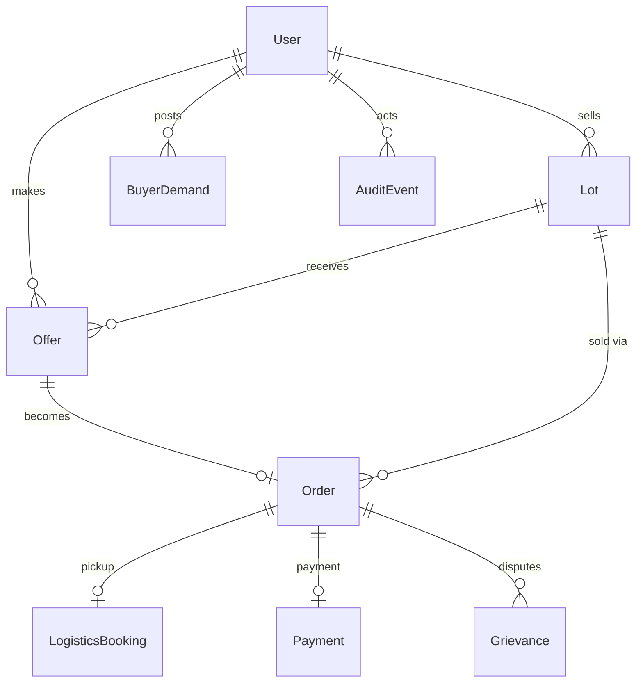
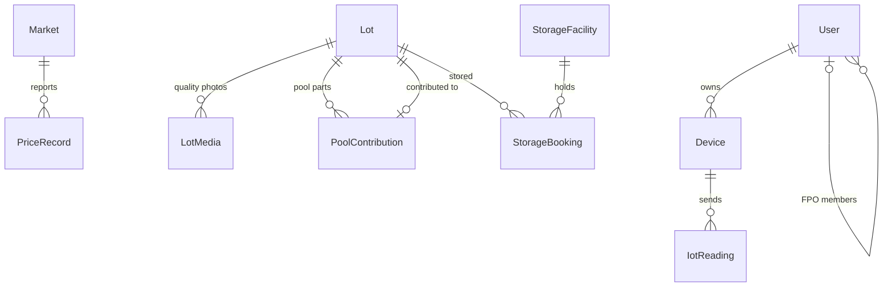
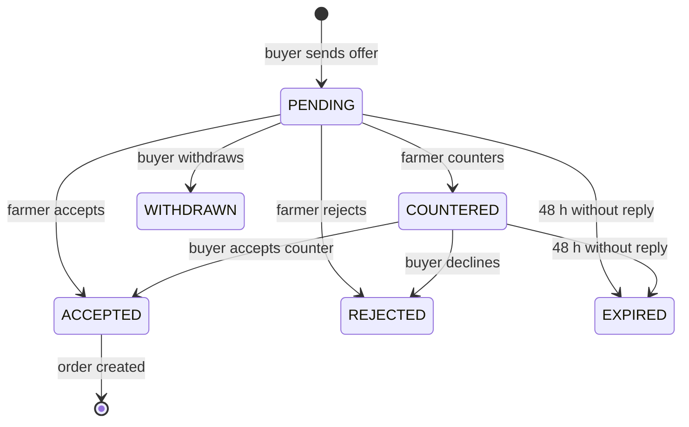
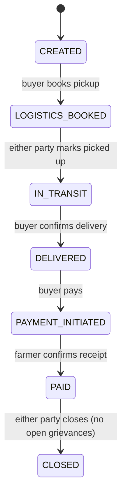
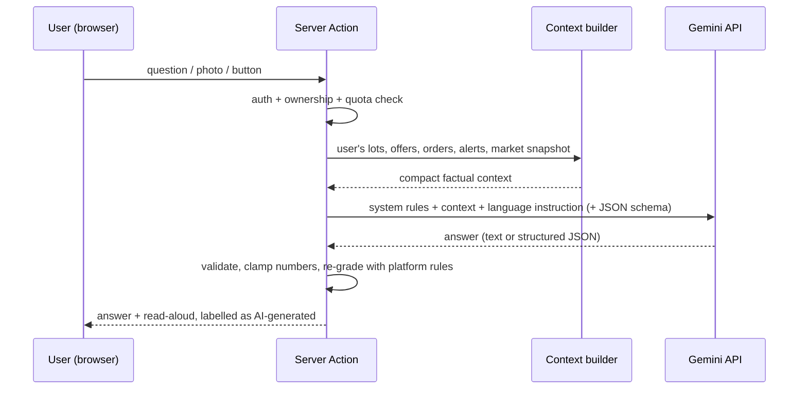

# FASALSETU AI — Technical Documentation

**SIH26132 · Strengthening Market Linkages and Price Discovery for Farmers · Team CODESURGE**

*Know your price. Know your buyer. Sell with confidence.*

| | |
|---|---|
| Live application | https://fasalsetu-ai-bice.vercel.app (private — access code required) |
| Version | 1.0 · September 2026 |
| Stack | Next.js 16 · React 19 · TypeScript · Prisma 6 · PostgreSQL (Neon) · Vercel Blob · Google Gemini |
| Codebase | ~8,700 lines of TypeScript · 17 database tables · 38 server actions · 40 automated tests |
| Languages | English and Hindi interface; English, Hindi and Marathi AI answers and voice |

---

## 1. Executive summary

Indian farmers usually decide where to sell by looking at the **highest mandi price**. That number is misleading: a
far-away mandi with a high price can leave the farmer with *less* money than a nearby one once transport, loading and
market charges are paid. Buyers, meanwhile, struggle to find reliable, quality-graded supply, and small farmers lack the
bargaining power and paperwork that make trade trustworthy.

FASALSETU AI turns fragmented market signals into a **selling decision based on net realisation** — what the farmer
actually keeps — and then carries the deal all the way through:

1. **Digital lot** with measured or AI-estimated quality.
2. **SmartSell** ranks every mandi *and* every live buyer offer by net ₹ per quintal, with confidence and reasons, and
   compares selling now against storing.
3. **Verified buyer matching**, offers, counter-offers and expiry.
4. A **SHA-256 fingerprinted digital agreement** for every deal.
5. **Execution**: pickup, delivery confirmation and payment (mock providers), with a full audit trail.
6. **Trust**: grievances, admin triage and verification.
7. **FPO pooling** so small farmers can sell in bulk and share proceeds pro-rata.
8. **Gemini-powered AI** in the farmer's language — a grounded assistant, voice lot entry, photo grading and advisors.

The core decision engine is deterministic and fully explainable; AI is layered on top to explain, extract and advise,
never to invent numbers.

---

## 2. Feature overview

### 2.1 Market and decision features

| Feature | What it does | Where |
|---|---|---|
| PricePulse | Latest modal/min/max prices, arrivals, 7- and 30-day change, sparklines, 7-day trend projection with confidence, distance from the user | `/markets` |
| NetRealise | Deterministic net ₹/qt per mandi after cheapest transport plan, loading and 2% market charges | lot page |
| SmartSell | Ranks mandis and live offers together; recommendation text, reasons, confidence; nearest-mandi comparison | lot page |
| Sell now vs store | 7- and 14-day storage scenarios with projected price band, storage cost, shrinkage and double handling; verdict requires a 2% gain and non-LOW trend confidence | lot page |
| Fayda forecast | Profit scenarios from the farmer's own area, yield and cost; trend band ≤ 30 days ahead, historical P10/median/P90 beyond | `/farmer/fayda` |
| Digital lot & quality | Commodity-specific measurements graded by platform rules (live preview) or self-declared grade; photo evidence validated by file content and SHA-256 fingerprinted | lot form, lot page |
| Buyer matching | Weighted 0–100 score (distance, quantity fit, quality, price vs mandi net, verification) with reasons | lot page, buyer marketplace |
| Offers | Offer → counter → accept/decline/withdraw; 48 h server-side expiry; partial-quantity sales; oversized competing offers auto-closed | lot page, buyer page |
| Digital agreement | Canonical terms + SHA-256 fingerprint; re-verified on every view (tampering shows MISMATCH) | `/orders/[id]/agreement` |
| Logistics / payment | Mock providers: pickup quote, in-transit, delivered, payment initiated, payment confirmed | order page |
| Storage booking | Compatible facilities by distance; capacity-checked booking and cancellation | lot page |
| Grievances | Either party raises; admin resolves; closing blocked while any grievance is open | order page, admin |
| FPO pooling | Pool members' open lots of one commodity; grade = lowest contributed grade; pro-rata payouts | `/fpo` |
| Field Nigrani (IoT) | Device registration (key shown once, stored hashed), HTTPS ingestion API, 48 h dashboards, comfort-band alerts feeding SmartSell | `/farmer/field` |
| Scheme recommender | Rule-based suggestions with reasons and official links — explicitly not an eligibility decision | `/farmer/schemes` |
| Admin | Verification, grievances, all orders, CSV market-data import with row-level errors, data-source registry | `/admin` |

### 2.2 AI features (Google Gemini)

| Feature | What it does |
|---|---|
| Kisan Sahayak chat | Role-aware assistant grounded in the user's own lots, offers, orders, sensor alerts and market data; voice input and read-aloud |
| Explain SmartSell | Plain-language explanation of the recommendation in the chosen language |
| Voice/text lot entry | "120 quintal kanda kal kaata, size 50mm" → commodity, quantity (unit conversion), date, grade or measurements |
| AI photo grading | Vision model estimates quality parameters; graded with the platform's own rules; flags wrong-commodity photos; shown to buyers |
| Negotiation copilot | Accept / counter (with a price) / reject / wait for each offer |
| Fair-offer advisor | For buyers: offer range between the seller's mandi floor and the buyer's landed cost |
| Market brief | Four-bullet summary per commodity |
| Fayda explanation | Explains profit scenarios, break-even and how to improve margin |
| Storage & field advisory | Practical actions from sensor readings |
| Scheme explainer | Which suggestions to check first and how |
| FPO pooling advisor | Which lots to pool, grade trade-offs, where to sell |
| Grievance triage (admin) | Severity, likely cause, suggested resolution, evidence to request |

### 2.3 Language support

The whole interface switches between **English and Hindi** from the top bar — every page, label, status, generated
recommendation, match reason, scheme description and server message. AI answers, voice input and read-aloud work in
**English, Hindi and Marathi**; the Marathi setting keeps the interface in English.

---

## 3. Users and journeys

| Role | Can do |
|---|---|
| Farmer | Create lots, see SmartSell, upload photos, book storage, answer and counter offers, confirm pickup and payment, raise grievances, use Fayda, Field Nigrani, Schemes and the assistant |
| FPO | Pool member lots, sell pooled lots like any lot, see member payouts, get pooling advice |
| Buyer | Post demand, browse and filter lots with match scores, send offers, accept counters, book pickup, confirm delivery, pay, raise grievances |
| Admin | Verify users, triage and resolve grievances, import market data, view every order and the platform audit trail |

### 3.1 Judge demo (about 6 minutes)

1. Enter the access code → **Judge quick start** → Ramesh Patil's onion lot opens on SmartSell. Switch to **हिं** to show
   the Hindi interface.
2. Walk the lot page: recommendation with reasons, sensor alert, quality evidence, sell-vs-store table, all options
   ranked by net ₹/qt, buyers looking for onion.
3. Switch user → **Nashik Fresh Produce Co** → offer ₹1,880 × 100 qt. Switch → **FarmDirect Exports** → offer
   ₹1,900 × 120 qt.
4. Switch → **Ramesh**: SmartSell now weighs the offers against mandis. Counter Nashik Fresh at ₹1,950.
5. Switch → **Nashik Fresh**: accept the counter → order created, 20 qt remain, FarmDirect's oversized offer closes.
   Open **View digital agreement** (fingerprint intact).
6. Buyer: book pickup → picked up → confirm delivery → pay; raise a grievance. Farmer: confirm payment; closing is
   blocked until the grievance is resolved.
7. Switch → **Platform Admin**: triage and resolve; show verification, data sources and CSV import.
8. Switch → **Nashik Kanda Producers FPO**: pool member lots and show the payout split.

---

## 4. System architecture



**Request flow.** Every request first hits the **proxy** (`src/proxy.ts`). Unless it carries the access-code cookie it
is redirected to `/access` (pages) or refused with 401 (APIs, actions, media). Pages are **React Server Components**
that query the database directly and call the pure **engine** for all calculations. Every mutation is a **Server
Action** that authenticates the user, authorises by role *and* ownership, validates input with zod, applies a guarded
state transition inside a transaction, writes an audit event, and revalidates the UI. AI features are server actions
that assemble grounded context and call Gemini; the key never reaches the browser.

### 4.1 Technology stack

| Layer | Choice | Why |
|---|---|---|
| Framework | Next.js 16 (App Router, Server Actions, Proxy) | One codebase for UI and backend; no separate API tier to secure |
| UI | React 19, Tailwind CSS 4 | Server-rendered, mobile-first, progressive enhancement |
| Language | TypeScript 5 (strict) | End-to-end types from database to UI |
| Validation | zod 4 | Every form and API payload validated on the server |
| ORM | Prisma 6 | Typed queries, transactions, schema push |
| Database | PostgreSQL on Neon (Singapore) | Serverless Postgres close to India; pooled + direct connections |
| File storage | Vercel Blob (private) | Photos never publicly addressable |
| AI | Google Gemini (default `gemini-2.5-flash`, auto-fallback) | Multilingual, vision, structured JSON output |
| Voice | Browser Web Speech API | Speech-to-text and text-to-speech in hi-IN, mr-IN, en-IN with no extra service |
| Hosting | Vercel (functions in `sin1`) | Zero-ops deploys, encrypted environment variables |
| Tests | Vitest | Fast unit tests for the engine, i18n and message catalogue |

### 4.2 Code structure

```text
src/
  proxy.ts                 access-code gate for every request
  app/                     pages (Server Components) and route handlers
    login/ access/         demo login, access code
    farmer/                dashboard, lots/[id], fayda, field, schemes
    fpo/ buyer/ admin/     role dashboards
    markets/               PricePulse
    orders/[id]/           order execution + agreement
    assistant/             Kisan Sahayak chat
    api/                   health, ready, iot/readings, sample-prices
    media/[id]/            access-checked photo delivery
  components/              UI kit, forms, i18n provider, AI panels, voice
  lib/
    engine/                PURE domain logic (no I/O) + unit tests
      logistics.ts         distance and cheapest vehicle plan
      forecast.ts          least-squares trend, projection band
      netRealise.ts        NetRealise, SmartSell options, sell-vs-store
      matching.ts          buyer match score
      quality.ts           grading rules
      states.ts            offer / order / lot state machines
      agreement.ts         canonical JSON + SHA-256
      fayda.ts, schemes.ts, priceCsv.ts, config.ts
    actions.ts             all business server actions
    ai/                    Gemini client, grounding context, AI actions, photo grading
    decision.ts, match.ts  engine + database orchestration
    marketplace.ts         expiry, pool payouts, IoT summaries, data sources
    i18n.ts, lang.ts       localisation helpers
    actionMessages.ts      Hindi catalogue for server messages
    session.ts, access.ts  demo session and access gate
    media.ts               upload validation, Blob/local storage
prisma/
  schema.prisma            17 models
  seed.ts                  deterministic demo data
```

---

## 5. Data model

**Marketplace and trust**



**Market data, quality, storage, pooling and sensors**



| Model | Purpose | Key fields |
|---|---|---|
| User | Farmer, FPO, buyer or admin | role, district, verified, fpoId, landAcres, socialCategory |
| Market | APMC mandi | name, district, lat/lng |
| PriceRecord | Daily price observation | commodity, date, min/modal/max, arrivalsQt, source (DEMO/SAMPLE or CSV_IMPORT) |
| Lot | Produce offered for sale | commodity, quantityQt, availableQt, qualityGrade, qualityParams, status, isPool |
| LotMedia | Quality photo | mimeType, sizeBytes, sha256, storedAs, aiAssessment |
| PoolContribution | Member lot inside an FPO pool | poolLotId, memberLotId, farmerId, quantityQt |
| BuyerDemand | What a buyer wants | commodity, quantityQt, qualityMin, pricePerQt, deliveryDays |
| Offer | Buyer's bid on a lot | pricePerQt, counterPricePerQt, quantityQt, matchScore, status, expiresAt |
| Order | Accepted deal | agreedPrice, quantityQt, agreementTerms, agreementHash, status |
| LogisticsBooking | Pickup (mock provider) | vehicle, trips, distanceKm, quoteCost, status |
| Payment | Payment (mock provider) | amount, reference, status |
| StorageFacility / StorageBooking | Warehouses and reservations | capacity, availableQt, costPerQtPerDay / quantity, days, status |
| Grievance | Dispute on an order | category, description, status, resolutionNote |
| Device / IotReading | Field Nigrani sensors | keyHash, keyHint, purpose / metric, value, recordedAt |
| AuditEvent | Immutable-style activity log | action, detail, actor, lot/offer/order links |

Indexes cover the hot paths: prices by commodity and date, lots by status and commodity, offers by lot/buyer and status,
IoT readings by device, metric and time, and audit events by order and lot.

---

## 6. Decision engine

All engine code lives in `src/lib/engine/` and performs no I/O, so every rule below is unit-tested.

### 6.1 NetRealise

For a lot of *Q* quintals and a mandi with modal price *P*:

```text
distance     = max(8 km, straight-line km × 1.25 road factor)
transport    = cheapest single-vehicle plan:
               trips × max(₹800, rate/km × distance) + ₹12/qt loading
               vehicles: Tempo 25 qt ₹22/km · Mini truck 70 qt ₹32/km
                         Truck 100 qt ₹42/km · Large truck 160 qt ₹55/km
charges      = 2% × P × Q
net total    = P × Q − transport − charges
net per qt   = net total ÷ Q
```

A buyer's farm-gate offer is worth price × quantity with no deductions, because the buyer pays for pickup.

**Confidence.** HIGH when the price is at most 1 day old with ≥100 qt arrivals; MEDIUM when at most 3 days old with ≥30
qt; otherwise LOW. If the last seven modal prices vary by more than 8% (coefficient of variation), confidence drops one
level.

### 6.2 SmartSell

SmartSell merges mandi options and live offers, sorts by net ₹/qt and explains the winner: price and freshness,
transport plan, charges, the margin over the runner-up, and what the nearest mandi would pay. With no market data it
says so instead of estimating.

### 6.3 Sell now or store

For 7 and 14 days, and for every mandi with a trend, the engine projects the price, then subtracts storage
(₹/qt/day × days + ₹8/qt handling), shrinkage (onion 0.2%/day, soybean 0.02%/day, wheat 0.01%/day), transport
farm → store → mandi, and charges. **Store** is recommended only if the best scenario beats selling now by at least 2%
*and* the trend confidence is not LOW.

### 6.4 Price trend

Ordinary least squares over the last 30 days of modal prices. The projection band is ±1.64 × residual standard deviation
(about 90%). Confidence is HIGH with ≥21 points and R² ≥ 0.5, MEDIUM with ≥14 points and R² ≥ 0.2, otherwise LOW.
Fayda uses the trend only up to 30 days ahead; beyond that it uses the 90-day P10 / median / P90.

### 6.5 Buyer match score (0–100)

| Component | Weight | Rule |
|---|---|---|
| Distance | 30 | Linear from 30 at 0 km to 0 at 300 km |
| Quantity fit | 25 | min(lot, demand) ÷ max(lot, demand) |
| Quality | 20 | Full if lot grade ≥ buyer's minimum, else 0 |
| Price | 15 | Full if the indicative price ≥ farmer's best mandi net, falling to 0 at 15% below |
| Verification | 10 | Buyer verified |

### 6.6 Quality grading

| Commodity | PREMIUM | A | B | Else |
|---|---|---|---|---|
| Onion | bulb ≥ 55 mm, damaged ≤ 2%, sprouted ≤ 1% | ≥ 45 mm, ≤ 5%, ≤ 3% | ≥ 35 mm, ≤ 10%, ≤ 6% | C |
| Soybean | moisture ≤ 10%, foreign matter ≤ 0.5%, damaged ≤ 1% | ≤ 12%, ≤ 1%, ≤ 3% | ≤ 14%, ≤ 2%, ≤ 6% | C |
| Wheat | moisture ≤ 10%, foreign matter ≤ 0.25%, broken ≤ 1% | ≤ 12%, ≤ 0.75%, ≤ 3% | ≤ 14%, ≤ 1.5%, ≤ 6% | C |

The grade is the strictest band every parameter meets; the UI reports which parameters held it back. A pooled lot takes
the lowest contributed grade.

---

## 7. Transactions, integrity and audit





- **Race safety.** Every transition is a guarded `updateMany` whose `WHERE` includes the expected current state (and,
  for lots, the expected available quantity). If another request got there first, zero rows change and the user sees
  "refresh the page" instead of a double sale.
- **Partial sales.** Accepting an offer reduces `availableQt`; the lot becomes PARTIALLY_SOLD or SOLD, and other open
  offers larger than the remainder close automatically.
- **Agreement.** On acceptance the platform records canonical terms (seller, buyer, commodity, grade and basis,
  quantity, price, total, delivery, payment and dispute terms, timestamp) as key-sorted JSON and stores its SHA-256
  fingerprint. The agreement page recomputes the hash on every view, so any later edit shows **MISMATCH**. This is a
  platform record, not a registered legal contract; no blockchain is used.
- **Audit trail.** Every business action writes an `AuditEvent`, shown per lot, per order and platform-wide.
- **Pool payouts.** Settled and pending order value from a pooled lot is split by each member's contributed quantity.

---

## 8. AI layer



- **Grounding.** Every prompt carries a compact snapshot of the user's own data and the market board, with an
  instruction to use only those figures, never to invent numbers, and to say when data does not cover a question.
  Market prices are always described as DEMO/SAMPLE.
- **Structured outputs.** Extraction, photo grading, negotiation advice and triage use JSON schemas; results are
  validated and clamped to valid ranges. Photo estimates are graded by the same rules as measured lots, and a
  wrong-commodity photo gets no grade.
- **Resilience.** If the configured model is unavailable the client discovers an available Flash model; if a model
  rejects the schema it retries with the schema in the prompt; requests time out after 45 s; every failure becomes a
  clear, localised message.
- **Protection of the key.** The key lives only in server environment variables. Beyond the site-wide access code, AI
  calls are limited to 15 per minute per user and 300 per hour overall.
- **Voice.** Speech-to-text and read-aloud use the browser's Web Speech API in `en-IN`, `hi-IN` and `mr-IN`.

---

## 9. Localisation

- Interface strings are written inline as `t("English", "हिंदी")`, so each screen reads naturally in one place; server
  pages use `getT()`, client components use `useT()` from a context provider set in the root layout.
- The language is a cookie (`fs_lang`) set by the EN / हिं / मरा toggle, so server rendering, AI prompts and voice all
  agree.
- The decision engine takes a language parameter: numbers are computed once; only the explanatory sentences change.
- Server messages are built in English and translated at the edge by a catalogue (`actionMessages.ts`) with exact
  strings and patterns for messages containing numbers and names. A unit test scans the source for every fixed
  message and fails if any lacks a Hindi version.
- Proper nouns (mandi names, people) stay as written. The recorded agreement terms stay in English because the
  fingerprint covers them; the Hindi page shows a display translation.

---

## 10. Security

| Area | Control |
|---|---|
| Access | Site-wide access code checked in the proxy; cookie stores a SHA-256 hash of the code, httpOnly, secure, 30 days; 8 guesses per 10 minutes per IP; constant-time comparison |
| Authorisation | Every server action re-checks the session, the role and ownership of the lot, offer or order; pages do the same |
| Input validation | zod schemas on every form; numeric ranges, enums, date sanity; CSV rows validated individually |
| State integrity | Guarded transitions inside transactions; idempotent under double clicks |
| Uploads | Size limit 3 MB, 4 per lot; type detected from file bytes (JPEG/PNG/WebP), not the file name; stored in a private Blob store; served only through an access- and login-checked route with `nosniff` and a restrictive CSP |
| Devices | Per-device random keys shown once and stored as SHA-256 hashes; payload validation; 30 requests/min per device |
| Secrets | Gemini key, database URLs, Blob token and access code are encrypted Vercel environment variables; `.env*` files are excluded from uploads; nothing secret is sent to the browser |
| CSRF | Next.js Server Actions compare Origin with Host |
| Audit | Business actions logged with actor and timestamp |

**Known limits.** Login inside the gate is a demo account picker by design (anyone with the code can act as any demo
user, including admin). Rate limits are in-memory per server instance, so on Vercel they are best-effort; the access code
is the real barrier. Production would add OTP login and a shared rate-limit store.

---

## 11. Interfaces

### 11.1 HTTP endpoints

| Method & path | Access | Purpose |
|---|---|---|
| `GET /api/health` | open | Process liveness |
| `GET /api/ready` | access code | Database round-trip and latest market record |
| `POST /api/iot/readings` | device key (`x-device-key`) | Ingest up to 100 readings: `temperature_c`, `humidity_pct`, `soil_moisture_pct` |
| `GET /api/sample-prices` | admin | Sample CSV for the importer |
| `GET /media/[id]` | access code + login | Lot photo |

Example device call:

```bash
curl -X POST https://fasalsetu-ai-bice.vercel.app/api/iot/readings \
  -H 'x-device-key: <device key>' -H 'content-type: application/json' \
  -d '{"readings":[{"metric":"humidity_pct","value":68.5},{"metric":"temperature_c","value":27.9}]}'
```

### 11.2 Server actions

| Group | Actions |
|---|---|
| Session | `loginAs`, `logout`, `quickStart`, `unlock` |
| Lots | `createLot`, `withdrawLot`, `uploadLotMedia`, `createPool`, `bookStorage`, `cancelStorage` |
| Demand & offers | `createDemand`, `deleteDemand`, `sendOffer`, `withdrawOffer`, `counterOffer`, `acceptOffer`, `acceptCounter`, `rejectOffer`, `rejectCounter` |
| Orders & trust | `runOrderAction` (six steps), `createGrievance`, `resolveGrievance` |
| Profile, IoT, admin | `updateProfile`, `registerDevice`, `setVerified`, `importPrices` |
| AI | `askAssistant`, `explainLot`, `parseLotText`, `analysePhoto`, `adviseOffer`, `adviseBuy`, `marketBrief`, `explainFayda`, `storageAdvice`, `explainSchemes`, `fpoAdvice`, `triageGrievance` |

---

## 12. Deployment and operations

| Component | Where |
|---|---|
| Application | Vercel project `stringly/fasalsetu-ai`, functions in `sin1` (Singapore) |
| Database | Neon PostgreSQL (free plan), Singapore, via the Vercel Marketplace |
| Photos | Vercel Blob store `fasalsetu-media`, private, Singapore |
| AI | Google Gemini API |

**Environment variables:** `DATABASE_URL`, `DATABASE_URL_UNPOOLED`, `BLOB_READ_WRITE_TOKEN` (added by the integrations),
`ACCESS_CODE`, `GEMINI_API_KEY`, optional `GEMINI_MODEL`.

```bash
# add or rotate secrets (stored encrypted, marked sensitive)
vercel env add GEMINI_API_KEY production
vercel env rm ACCESS_CODE production && vercel env add ACCESS_CODE production
vercel deploy --prod                      # env changes apply on the next deploy

# local development
npm install
vercel env pull .env.local                # Neon + Blob credentials
npm run dev                               # access code is off locally unless set
set -a; source .env.local; set +a
npx prisma db push                        # apply schema changes
npm run seed                              # reset demo data (shared database) and print device keys
```

Quality gates: `npm test` (40 tests), `npm run typecheck`, `npm run lint`, `npm run build`.

---

## 13. Testing and verification

**Automated (Vitest, 40 tests):** distance and vehicle planning; least-squares trend, projection and percentage change;
NetRealise deductions and confidence downgrades; ranking; sell-vs-store verdicts; match scoring; offer/order state
machines and lot status; quality grading and parameter validation; agreement hashing and tamper detection; Fayda maths;
scheme rules; CSV import validation; offer expiry; rate limiting; Hindi engine output; message catalogue coverage.

**Verified end to end in the browser and against the live deployment:** access gate (pages redirect; APIs, actions and
media return 401; wrong code rejected); full farmer → buyer → counter → accept → pickup → delivery → payment →
grievance → admin resolution flow; partial sale and auto-closing of oversized offers; agreement tamper detection;
disguised-file upload rejection; storage over-booking blocked server-side; IoT key hashing, validation and rate limit;
FPO pooling and exact pro-rata payout; CSV import with row-level errors and duplicate skipping; Hindi across all pages
for every role; AI request path confirmed against Google's API.

---

## 14. Limitations and roadmap

| Today | Next step |
|---|---|
| Market prices are seeded DEMO/SAMPLE data plus admin CSV imports | Licensed AGMARKNET / e-NAM connectors behind the existing source registry |
| Logistics, storage and payment are mock providers | Real transporter, warehouse and payment/escrow partners behind the same order steps |
| Demo account picker inside an access-code gate | Phone OTP login, per-user sessions |
| In-memory rate limits | Shared store (Redis/Upstash) |
| Straight-line × 1.25 distances | Routing API distances and live freight quotes |
| Trend projection is linear | Seasonal models once enough real history exists; accuracy tracked |
| Scheme rules are unverified suggestions | Rules verified against official notifications, with dates |
| Hindi interface; Marathi for AI only | Full Marathi interface using the same pattern |
